# MapR Install


> 이 글은 MAPR을 **GCP VM(Ubuntu16.04)**에 설치하는 과정을 설명하고 있습니다.
> (여기서는 GCP 계정을 가지고 있고 VM 생성을 할 수 있다는 가정하에 진행되겠습니다.)


## step1. 설치전 준비사항

> 가장 중요한 단계 입니다. 아래조건이 맞지 않다면 설치중 에러를 만나게 됩니다.

- MARP 홈페이지에서 [계정등록](https://mapr.com/user/register/)을 한다.
	- 설치 단계중 라이선스 인증시에 계정정보를 입력해야 한다.

- root 권한 및 접속시 비밀번호를 생략할 수 있도록 설정해야 한다.
	-  설치시 sudo 권한관련 에러가 발생할 수 있다.

- memory : 32GB 이상 권장(최소허용 16GB)
	- 메모리 용량이 작으면 설치시 멈춰버리고 에러가 발생할 수 있다.

- MAPR이 저장될 별도의 디스크 또는 파티션이 필요하다.
	- ex) /dev/sda 에 Linux OS 올라가 있다면 /dev/sdb에 MAPR을 올린다.

- Linux OS가 올라간 디스크 용량은 200GB 이상으로 설정한다.
	- /opt/mapr 128GB 이상 권장(최소허용 30GB)


## step2. GCP VM에 Disk 추가

> GCP VM(이하 mapr-vm)에 Disk를 추가하고 파티션으로 등록하는 과정입니다. 
> (여기서는 VM 만드는 과정은 생략하겠습니다. [여기 참조](https://cloud.google.com/compute/docs/quickstart-linux?hl=ko))

- **GCP > Compute Engine > 디스크** 경로로 접속

- 상단에 **디스크 만들기** 클릭해서 새로운 디스크 생성
	- ex. 디스크명은 mapr-disk

- mapr-vm 수정에서 **디스크 추가**에 mapr-disk 추가

- mapr-vm에 ssh로 접근

```bash
$ sudo fdisk -l 
# 파티션 현황을 보면 /dev/sdb가 추가되어 있다.
$ sudo fdisk /dev/sdb
```


- p : partition 현황체크
- n : new partition(파티션 만드는 명령어)
- enter 3번
- w : write(저장)

```bash
$ sudo fdisk -l
```

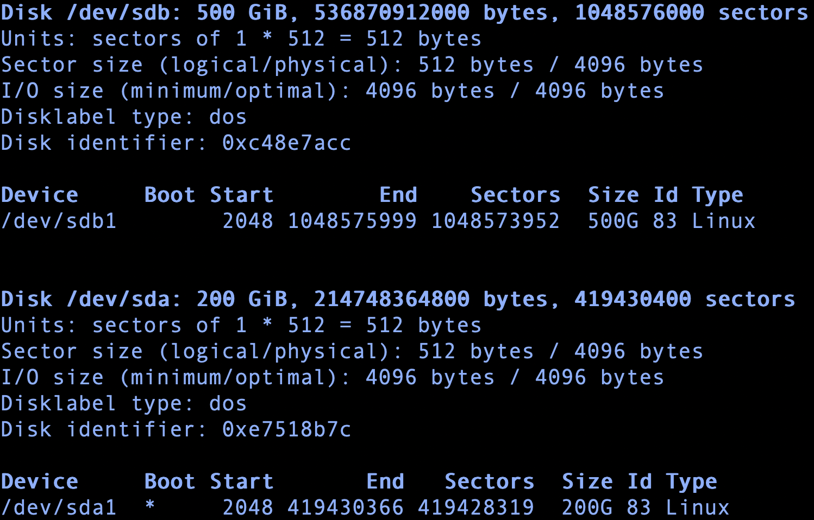


## step3. Terminal 작업

- sudo 권한 비밀번호 없이 접근

```bash
# 쓰기권한 부여
$ sudo chmod +w /etc/sudoers
# 본인이 원하는 텍스트에디터 사용해도 무관
$ sudo emacs /etc/sudoers
# 내부에서 아래내용처럼 기입
root   ALL=(ALL:ALL)  ALL
<계정명> ALL=(ALL:ALL)  ALL
```

- mapr-setup.sh 다운

```bash
$ wget https://package.mapr.com/releases/installer/mapr-setup.sh -P /tmp
```

- mapr-setup.sh 실행권한 부여

```bash
$ chmod +x /tmp/mapr-setup.sh
```

- mapr-setup.sh 실행

```bash
$ sudo bash /tmp/mapr-setup.sh
# admin name/passwd, uid, gid 설정하는게 나옴
# 그냥 계속 enter만 해도되고 passwd 설정이후에 잘 메모(기억)하길 바람
```

- MapR Installer 시작

```bash
https://<Installer Node hostname/IPaddress>:9443
# ex. https://10.100.131.66:9443
```


## step4. Web-UI 작업

> 여기서부터 본게임이다. 

- GCP 방화벽 규칙에 해당 port에 대한 내용 생성
	-	방법은 [여기 참조](http://gusrb.tistory.com/50)


- 로그인 : admin 계정정보 입력(Terminal 작업간 설정한거)

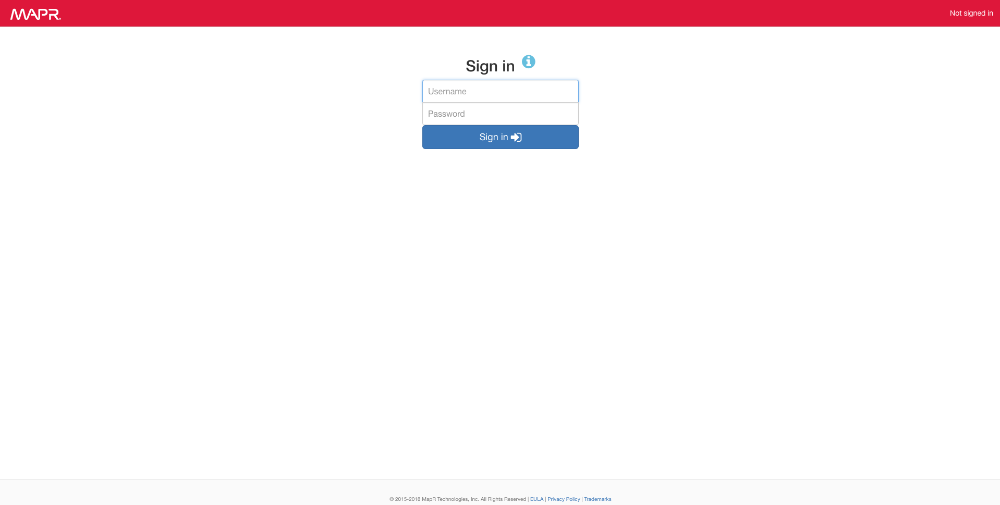

- 읽어보고 Next

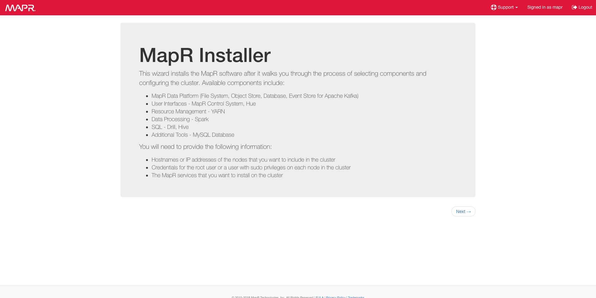

- MapR Version, Edition 선택(유료 or 무료), License 설정, MapR 계정인증, 용도별 설치파일 설정

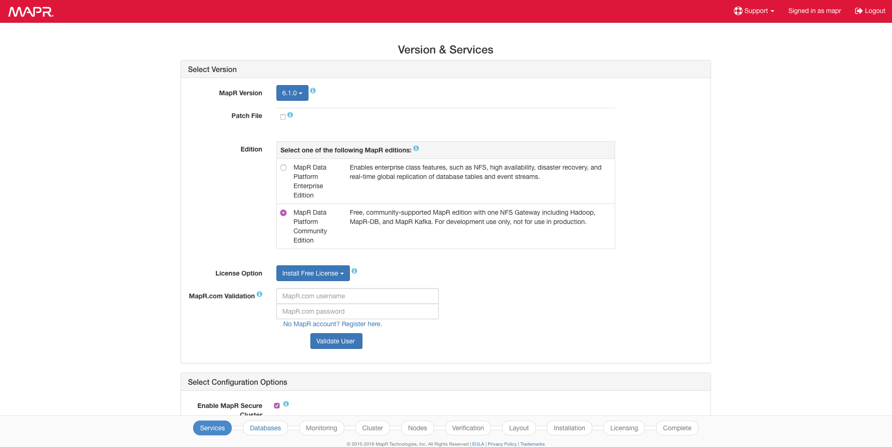

- Hive, Hue, Oozie, root 관련 설정

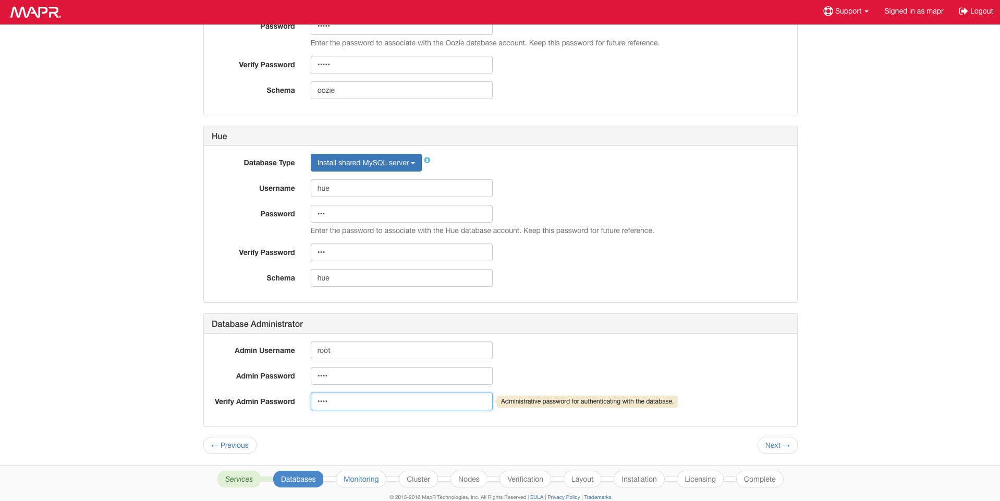

- 그냥 Next

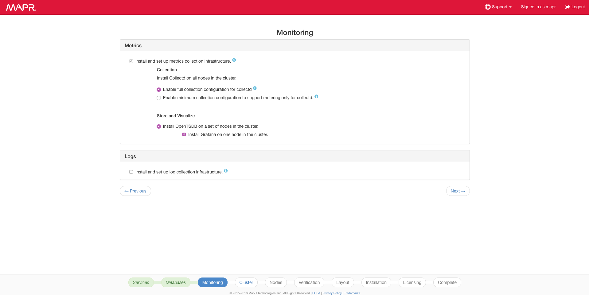

- admin 계정 passwd 입력

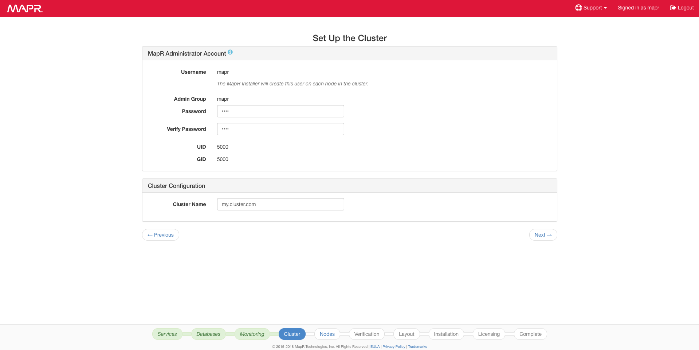

- Nodes 에 Local IP,  나머지 디스크(ex. /dev/sdb), ssh 접속가능한 계정정보 입력(passwd or private key)

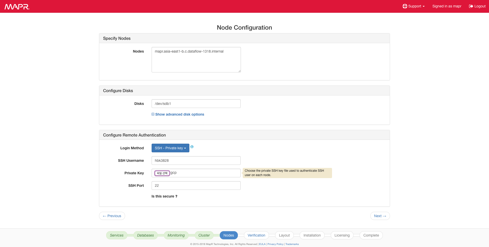

- MapR을 설치가 가능한지 여부를 평가(여기서 성공하면 나머지는 그냥 Next)

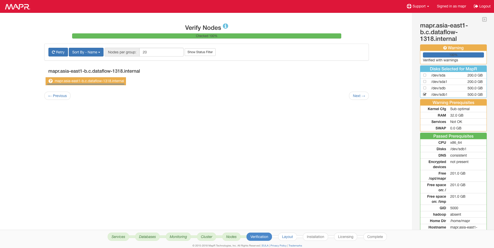

- 설치성공 페이지

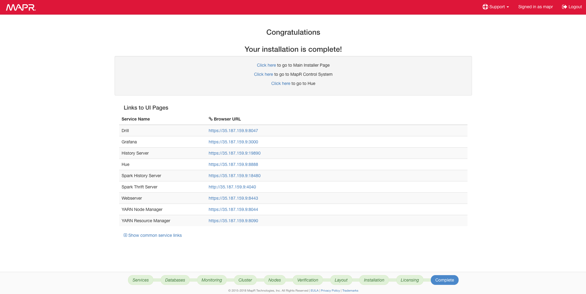

- GCP 방화벽 규칙에 해당 port에 대한 내용 생성


## step5. MapR Control System

- https://<Installer Node hostname/IPaddress>:8443
	- mapr admin 계정으로 로그인


- 설치된 컴포넌트 목록, 상태 및 리소스 모니터링 제공

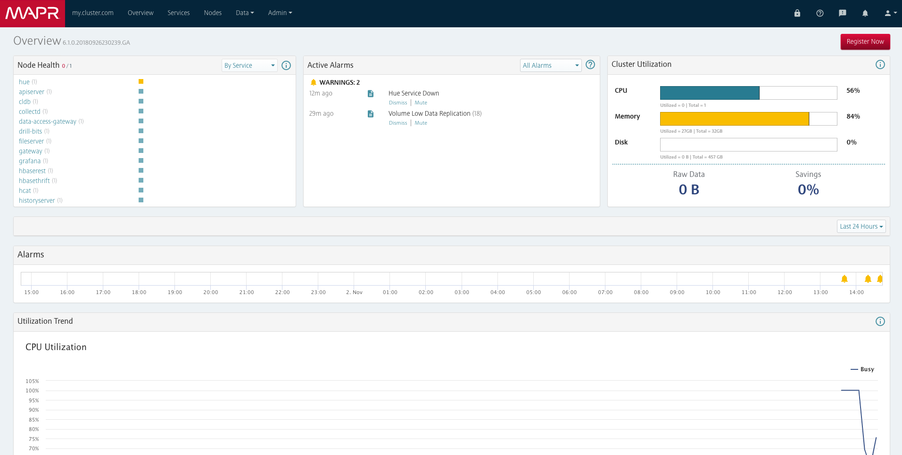
